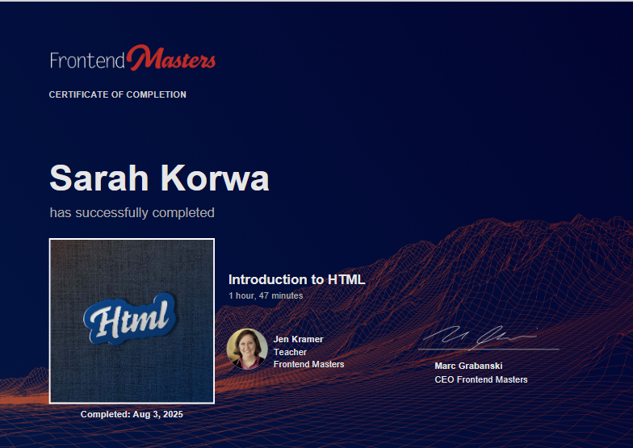

# Belajar HTML - Day 1 🌐

Repository ini berisi hasil belajar saya dalam mengikuti **Kursus Frontend Masters Bootcamp - Introduction to HTML**.  
Di sini saya mendokumentasikan progres pembelajaran HTML dari dasar, sekaligus membangun portofolio kecil dalam bentuk proyek sederhana.

Saya juga telah menyelesaikan kursus ini dan memperoleh **sertifikat kelulusan**, sebagai bukti kompetensi dasar dalam pengembangan web.

---

## ✨ Isi Repository
- `index.html` → Halaman utama
- File pendukung (asset) untuk latihan
- Dokumentasi progres belajar harian

---

## 🎯 Tujuan
- Melatih konsistensi dalam belajar pemrograman web  
- Membuat portofolio pribadi yang bisa dilihat publik  
- Menjadi pijakan awal untuk mempelajari teknologi web yang lebih kompleks

---

## 🚀 Demo
Hasil latihan ini dapat diakses secara langsung melalui GitHub Pages:  
👉 [Klik di sini](https://neskor17.github.io/Belajar-HTML-Day-1/)

---

## 📜 Sertifikat
Saya memperoleh sertifikat setelah menyelesaikan kursus **Frontend Masters Bootcamp - Introduction to HTML**, yang memperkuat kemampuan dasar saya dalam HTML dan pembuatan halaman web.

---

💡 *Repo ini akan terus diperbarui sesuai dengan progres belajar saya.*  
